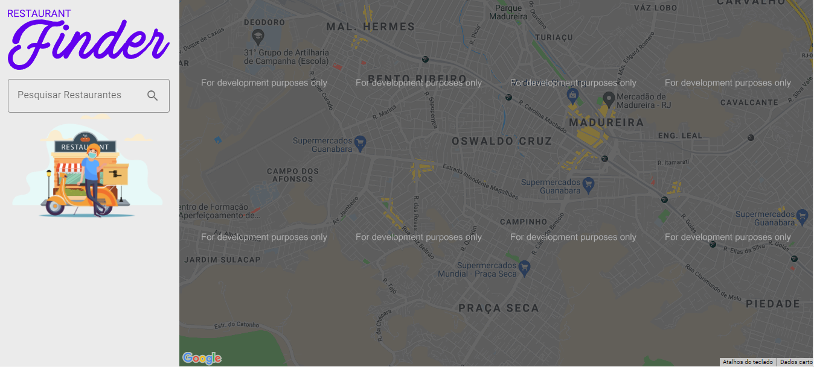

## Restaurants Finder
<h1 align="center">
    
</h1>
<p align="center">
    <a href="#projeto-">Projeto</a> &nbsp;&nbsp;&nbsp;|&nbsp;&nbsp;&nbsp;
    <a href="#tecnologias-">Tecnologias</a> &nbsp;&nbsp;&nbsp;|&nbsp;&nbsp;&nbsp;
    <a href="#layout-">Layout</a> &nbsp;&nbsp;&nbsp;|&nbsp;&nbsp;&nbsp;
    <a href="#licença-%EF%B8%8F">Licença</a>
</p>

### Layout 🚧
  
  
### Projeto 💻
Encontre um restaurante perto da sua casa com o uso do google maps e places API

## Rodar o projeto 🚴🏻‍♂️

#### On your machine:
<details>
    <summary>Dependencies</summary>

```json
  "dependencies": {
    "dotenv": "^10.0.0",
    "google-maps-react": "^2.0.6",
    "react": "^17.0.2",
    "react-dom": "^17.0.2",
    "react-lottie": "^1.2.3",
    "react-rating-stars-component": "^2.2.0",
    "react-redux": "^7.2.6",
    "react-scripts": "4.0.3",
    "react-slick": "^0.28.1",
    "redux": "^4.1.2",
    "slick-carousel": "^1.8.1",
    "styled-components": "^5.3.3",
  }
```
</details>

```bash
# Clone the repository
$ git clone https://github.com/GabrielMedradoS/Restaurants-Finder.git

# Access the project folder at the command prompt
$ cd Restaurants-Finder

# Install the dependencies
$ npm install

# Run the script "start"
$ npm start

# The project will start at the door: 3000 - access http://localhost:3000
```

### Tecnologias 🛠

- [react-material-icon](https://www.npmjs.com/package/@material/react-material-icon)
- [react-text-field](https://www.npmjs.com/package/@material/react-text-field)
- [react-slick](https://www.npmjs.com/package/react-slick)
- [react-rating-stars](https://www.npmjs.com/package/react-rating-stars-component)
- [google-maps-react](https://www.npmjs.com/package/google-maps-react)

- [react-lottie](https://www.npmjs.com/package/react-lottie)
- [lottiefiles](https://lottiefiles.com/)

<div>
  
  
   
   
</div>

## Licença ⚖️
This project is under the MIT license. See the archive [LICENSE](https://github.com/GabrielMedradoS/letmeask---NLW-Together/blob/master/License) for more details.

## Autor ✍🏾

| <a  href="https://github.com/gabrielmedrados/"><br><sub>Gabriel Medrado</sub></a>|
| :---: |
 
[](https://www.linkedin.com/in/gabriel-medrado-de-souza-9a30b3206/)
[](mailto:gabriel.medradoo@hotmail.com)
